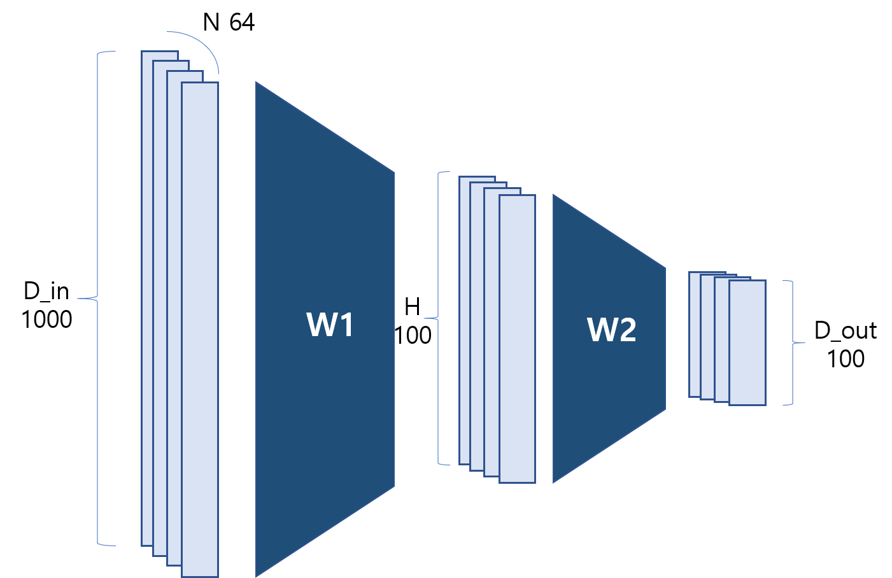

## [Autograd](https://pytorch.org/tutorials/beginner/pytorch_with_examples.html#id16) 

### [PyTorch: Tensors and autograd](https://pytorch.org/tutorials/beginner/pytorch_with_examples.html#id17)

*In the above examples, we had to manually implement both the forward and backward passes of our neural network. Manually implementing the backward pass is not a big deal for a small two-layer network, but can quickly get very hairy for large complex networks.*

이전 예제들을 보면, 인공신경망의 순전파/역전파 전달을 일일히 구현해야 했다. 사실 이런 작은 2-layer 네크워크에서 역전파 구현은 큰 문제거리가 아닐 수 있으나, 크고 복잡한 신경망에서의 구현은 아주 짜릿한 경험이 될 것이다. (너무 짜릿한 나머지 정신을 잃을 수 있다.)

*Thankfully, we can use [automatic differentiation](https://en.wikipedia.org/wiki/Automatic_differentiation) to automate the computation of backward passes in neural networks. The **autograd** package in PyTorch provides exactly this functionality. When using autograd, the forward pass of your network will define a **computational graph**; nodes in the graph will be Tensors, and edges will be functions that produce output Tensors from input Tensors. Backpropagating through this graph then allows you to easily compute gradients.*

고맙게도, 우리는 신경망의 역전파 계산을 자동으로 해주는 자동미분(Automatic differentiation)을 이용할 수 있다. 그리고 파이토치의 **Autograd 패키지는** 이런 자동미분의 기능을 똑같이 제공한다. Autograd를 이용할 때, 신경망 네크워크의 순전파는 **연산 그래프**(computational graph)를 정의하면서 진행한다. 연산그래프의 노드(node)는 텐서(어떤 벡터 혹은 스칼라값)을 나타내며, 연결선(edge)은 인풋으로부터 아웃풋이 나오게끔 하는 연산함수이다. (예를 들어 1+2=3 이라는 연산에서 인풋 1과 2는 노드가 되고, 아웃풋 노드 3을 만들어내는 '+'는 연산함수이다.)

*This sounds complicated, it’s pretty simple to use in practice. Each Tensor represents a node in a computational graph. If `x` is a Tensor that has `x.requires_grad=True` then `x.grad` is another Tensor holding the gradient of `x` with respect to some scalar value.*

이 말들이 복잡하게 들릴 수도 있지만, 실제로 사용할 때는 아주 간단하다. 각 텐서는 연산 그래프 안에서 하나의 노드를 나타낸다. 만약 어떤 텐서 x가 `x.requires_grad=True` 라고 설정된다면, `x.grad` 라는 또다른 텐서가 존재하는데 이는 `x`의 기울기 값(스칼라값)을 저장하고 있는 텐서이다.   

*Here we use PyTorch Tensors and autograd to implement our two-layer network; now we no longer need to manually implement the backward pass through the network:*

아래 코드는 파이토치의 Tensor와 autograd를 우리 2-layer 네트워크에 적용해보고자 한다. 우린 더 이상 일일히 네크워크를 통한 역전파를 구하지 않아도 된다!




```
# -*- coding: utf-8 -*-
import torch

dtype = torch.float
device = torch.device("cpu")
# device = torch.device("cuda:0") # 해당 코드는 GPU에서 돌아가게 하는 코드!

# N 배치 사이즈; D_in 인풋의 차원 # 여기선 위 그림의 세로 길이라고 생각하면 된다.
# H 은닉층의 차원; D_out 아웃풋의 차원
N, D_in, H, D_out = 64, 1000, 100, 10

# 임의의 인풋 아웃풋 텐서를 만든다.
# requires_grad=False 라고 설정하는 것은 역전파 전달 시 
# 해당 텐서는 기울기 계산이 필요없다는 것을 의미한다. (즉, 업데이트가 필요없다!)
# 일반적으로 텐서를 만들 때, False가 기본으로 설정되어 있다.

x = torch.randn(N, D_in, device=device, dtype=dtype)
y = torch.randn(N, D_out, device=device, dtype=dtype)

# 가충치 텐서들을 임의로 생성한다.
# requires_grad=True 라고 설정하는 것은 역전파 전달 시 
# 해당 텐서는 기울기 계산이 필요없다는 것을 의미한다. (즉, 업데이트가 필요하다!)
w1 = torch.randn(D_in, H, device=device, dtype=dtype, requires_grad=True)
w2 = torch.randn(H, D_out, device=device, dtype=dtype, requires_grad=True)

learning_rate = 1e-6
for t in range(500):
    # 순전파 : 텐서들의 연산을 통해서 예측되는 y을 계산하는 과정. 
    # 그렇다면 이 전 코드와는 무엇이 다를까? autograd를 사용하지 않았을 때는
    # 후에 역전파 계산을 위한 중간결과값을 하나하나 저장해놔야 했다.
    #그러나 지금은 그런 계산 없이 바로 최종 y까지 한번에 연산식을 구하면 된다.
    y_pred = x.mm(w1).clamp(min=0).mm(w2)

    # 손실을 구해보자. 
    # torch 0.4 버젼부터는 loss가 shape(1,) 1차원 텐서로 나온다
    # 그리고 loss.item()은 loss를 일반 스칼라값으로 변환하여 준다.
    # 생각보다 중요한 포인트다. 후에 메모리가 터지지 않으려면 loss는 스칼라값으로 갖고 있자. 
    loss = (y_pred - y).pow(2).sum()
    print(t, loss.item())
    
    # 이제 역전파 계산을 위해서 autograd를 사용해보자. backward() 함수를 부른다는 것은 
    # loss를 구하기 위해 사용되었던 텐서 중 requires_grad=True 라고 설정된 모든 텐서들의
    # 기울기를 구하라는 것이다. 이게 실행되고 나면 w1.grad와 w2.grad라는 해당 포인트에서 
    # w1과 w2에 대한 loss의 기울기 값을 가지고 있는 텐서가 생성된다. 
    loss.backward()

    # 기울기 하강법을 이용하여 가중치들을 업데이트 시켜보자. 코드를 보면 해당 부분이
    # torch.no_grad()로 감싸져 있는 것을 볼 수 있는데, 이것은 autograd가 연산을 추적하지
    # 하지 않아도 되기 때문이다. (이걸로 또 업데이트 할거 아니니까) 
    # 다른 방법으로는 w.data 와 w.grad.data 를 사용하는 것이다.
    # Tensor.data는 Tensor와는 같은 저장공간을 활용하지만, 그 연산기록을 저장하지는 않는다.
    # 또는 그냥 torch.optim.SGD 를 이용해서 할 수도 있다. 
    with torch.no_grad():
        w1 -= learning_rate * w1.grad
        w2 -= learning_rate * w2.grad

        # Manually zero the gradients after updating weights
        w1.grad.zero_()
        w2.grad.zero_()
```

### [PyTorch: Defining new autograd functions](https://pytorch.org/tutorials/beginner/pytorch_with_examples.html#id18) 새로운 autograd 함수 

*Under the hood, each primitive autograd operator is really two functions that operate on Tensors. The **forward** function computes output Tensors from input Tensors. The **backward**function receives the gradient of the output Tensors with respect to some scalar value, and computes the gradient of the input Tensors with respect to that same scalar value.*

내부적으로, 모든 기본적인 autograd 연산은 정말 딱 2가지의 텐서 연산 함수(순전파 함수/역전파 함수)로 이루어져 있다. **순전파 함수**는 인풋 텐서로부터 아웃풋을 계산한다. **역전파 함수**는 반대로 아웃풋 텐서의 gradient(scalar value)를 입력으로 받아 인풋 텐서의 기울기를 계산한다.  

*In PyTorch we can easily define our own autograd operator by defining a subclass of `torch.autograd.Function` and implementing the `forward` and `backward` functions. We can then use our new autograd operator by constructing an instance and calling it like a function, passing Tensors containing input data.*

파이토치에서는 `torch.autograd.Function`을 상속받아 새롭게 정의함으로써 쉽게 우리만의 autograd 연산함수만들어 순저파와 역전파를 구현할 수 있다. 그러면 우린 새롭게 정의된 autograd 연산 클래스를 불러 마치 함수부르 듯이 사용하면 되는 것이다. 

In this example we define our own custom autograd function for performing the ReLU nonlinearity, and use it to implement our two-layer network:

```
# -*- coding: utf-8 -*-
import torch


class MyReLU(torch.autograd.Function):
    """
    We can implement our own custom autograd Functions by subclassing
    torch.autograd.Function and implementing the forward and backward passes
    which operate on Tensors.
    """

    @staticmethod
    def forward(ctx, input):
        """
        In the forward pass we receive a Tensor containing the input and return
        a Tensor containing the output. ctx is a context object that can be used
        to stash information for backward computation. You can cache arbitrary
        objects for use in the backward pass using the ctx.save_for_backward method.
        """
        ctx.save_for_backward(input)
        return input.clamp(min=0)

    @staticmethod
    def backward(ctx, grad_output):
        """
        In the backward pass we receive a Tensor containing the gradient of the loss
        with respect to the output, and we need to compute the gradient of the loss
        with respect to the input.
        """
        input, = ctx.saved_tensors
        grad_input = grad_output.clone()
        grad_input[input < 0] = 0
        return grad_input


dtype = torch.float
device = torch.device("cpu")
# device = torch.device("cuda:0") # Uncomment this to run on GPU

# N is batch size; D_in is input dimension;
# H is hidden dimension; D_out is output dimension.
N, D_in, H, D_out = 64, 1000, 100, 10

# Create random Tensors to hold input and outputs.
x = torch.randn(N, D_in, device=device, dtype=dtype)
y = torch.randn(N, D_out, device=device, dtype=dtype)

# Create random Tensors for weights.
w1 = torch.randn(D_in, H, device=device, dtype=dtype, requires_grad=True)
w2 = torch.randn(H, D_out, device=device, dtype=dtype, requires_grad=True)

learning_rate = 1e-6
for t in range(500):
    # To apply our Function, we use Function.apply method. We alias this as 'relu'.
    relu = MyReLU.apply

    # Forward pass: compute predicted y using operations; we compute
    # ReLU using our custom autograd operation.
    y_pred = relu(x.mm(w1)).mm(w2)

    # Compute and print loss
    loss = (y_pred - y).pow(2).sum()
    print(t, loss.item())

    # Use autograd to compute the backward pass.
    loss.backward()

    # Update weights using gradient descent
    with torch.no_grad():
        w1 -= learning_rate * w1.grad
        w2 -= learning_rate * w2.grad

        # Manually zero the gradients after updating weights
        w1.grad.zero_()
        w2.grad.zero_()
```

